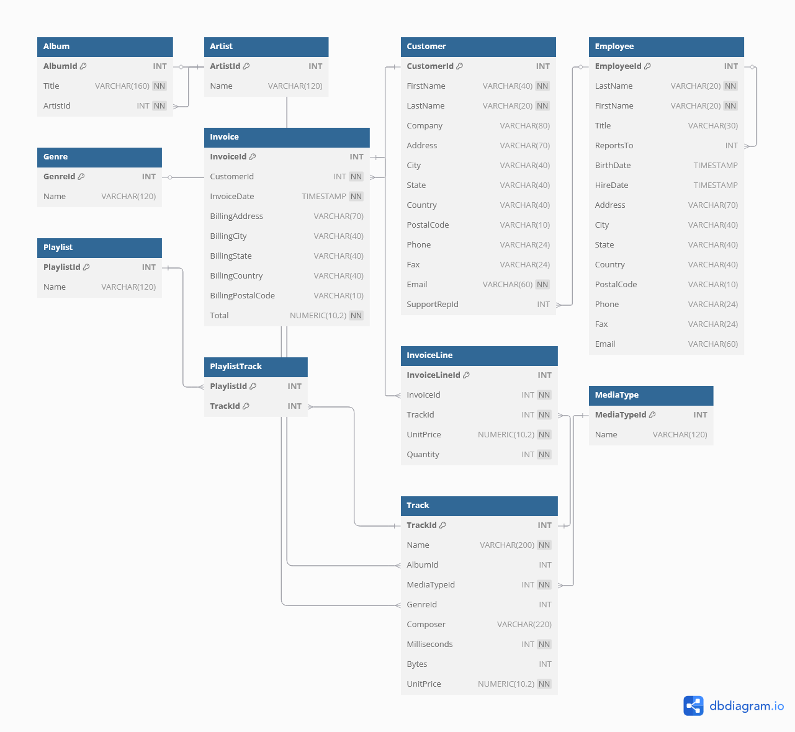

This repository contains the **Chinook database** and a set of example SQL queries. The Chinook database simulates a digital music store, with tables such as `Artist`, `Album`, `Track`, `Customer`, `Invoice`, and more. The SQL scripts provided are compatible with **PostgreSQL**.

## Repository Structure

- **/database/**
  - `Chinook_db.sql`: SQL file containing the structure and data of the Chinook database.
- **/queries/**
  - `Chinook_exploration_sql.sql`: File with example SQL queries to interact with the database.
- **/docs/**
  - `Chinook_diagram.png`: Database diagram.

## Database Diagram

## Usage Instructions

### 1. Clone the Repository
Clone the entire repository to your local machine:

git clone https://github.com/RRLuis/SQL-Portfolio-Projects.git
After cloning, navigate to the ChinookDB-Data-Exploration folder:
cd SQL-Portfolio-Projects/ChinookDB-Data-Exploration

### 2. Import the Database

Import the Chinook database (Chinook_db.sql) into your MySQL server (or any other compatible database management system):

### 3. Run Queries

Once the database is imported, you can run the example queries located in the Chinook_exploration_sql.sql file

## Example Queries: 
Here are some example queries you can find in the queries.sql file:

-- Calculates the total spend for each customer and displays the customer's name along
-- with the total amount spent.
select  concat(c.firstname, ' ', c.lastname) as customer_name, sum(i.total) as total_spent
from project_chinook.customer c 
join project_chinook.invoice i on c.customerid = i.customerid 
group by c.customerid
order by total_spent desc
limit 5;

-- Displays the title of songs that are not associated with any album.
select t.name as song_name
from project_chinook.track t 
left join project_chinook.album a on t.albumid = a.albumid 
where a.albumid is null;

## Requirements

    MySQL, PostgreSQL, SQLite, or any other compatible database management system.

    Tools like MySQL Workbench, DBeaver, or pgAdmin to run and visualize queries.
